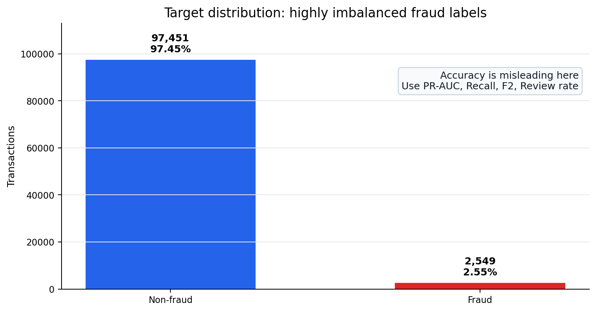
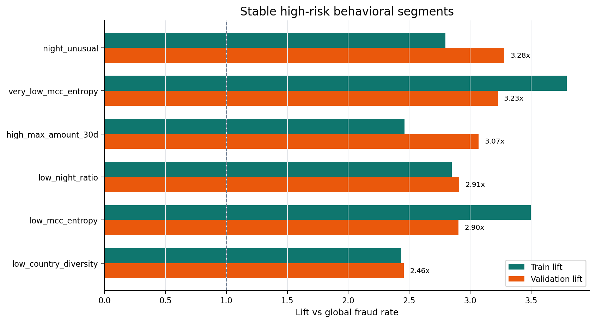
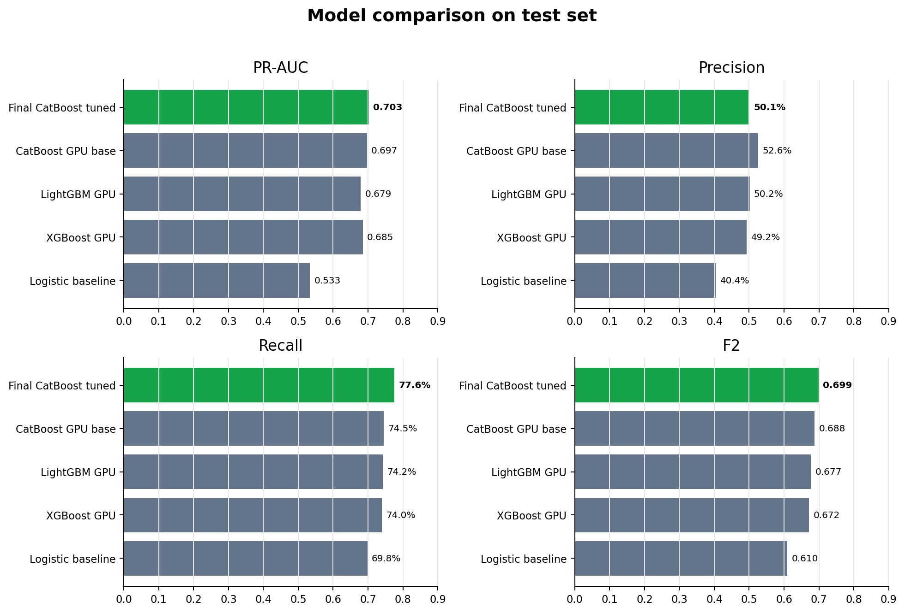
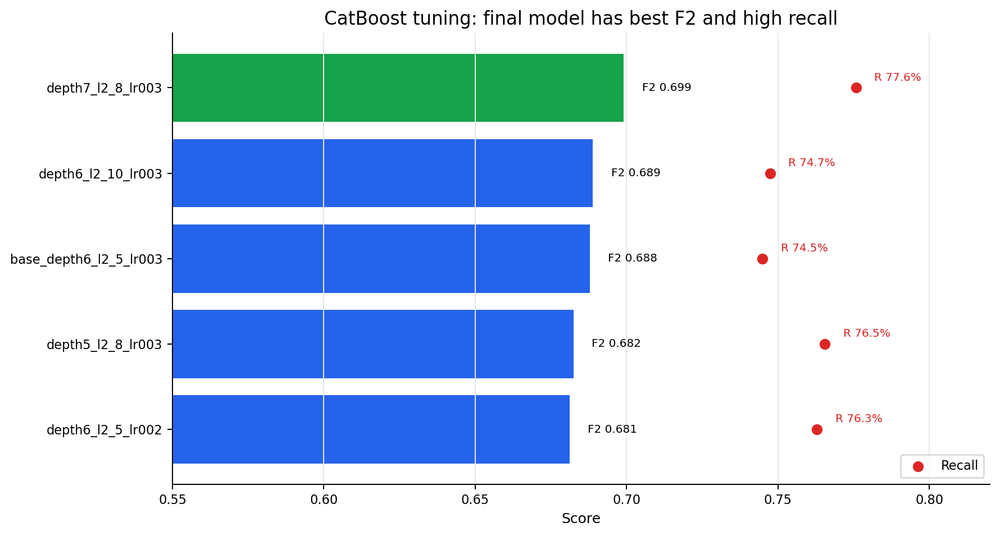
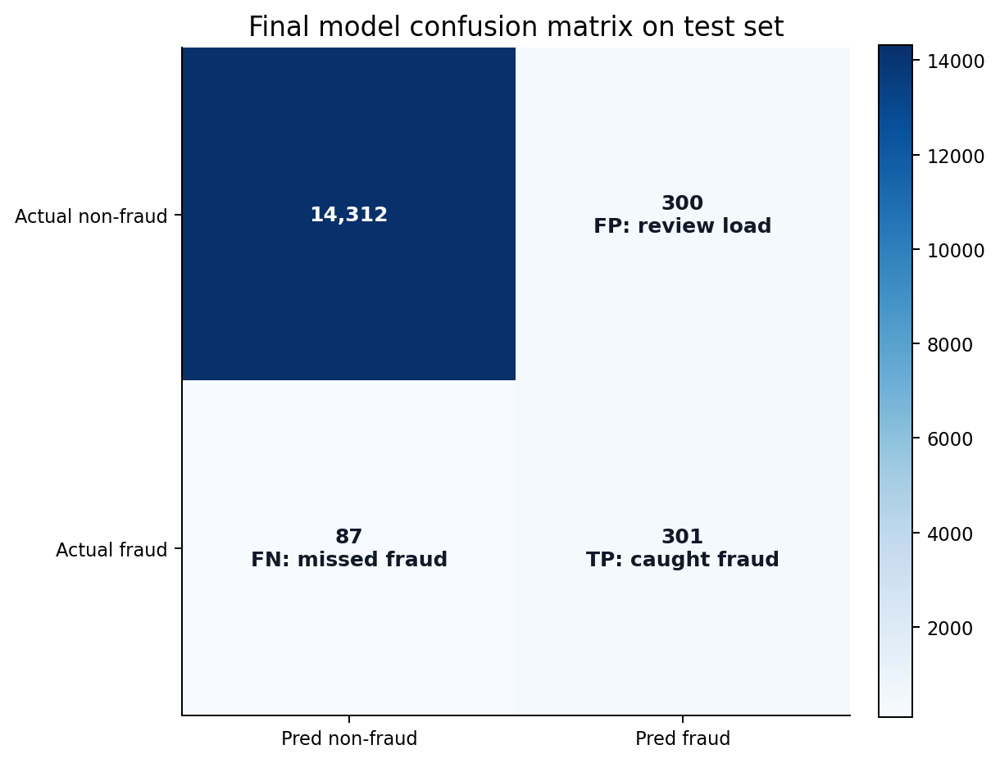
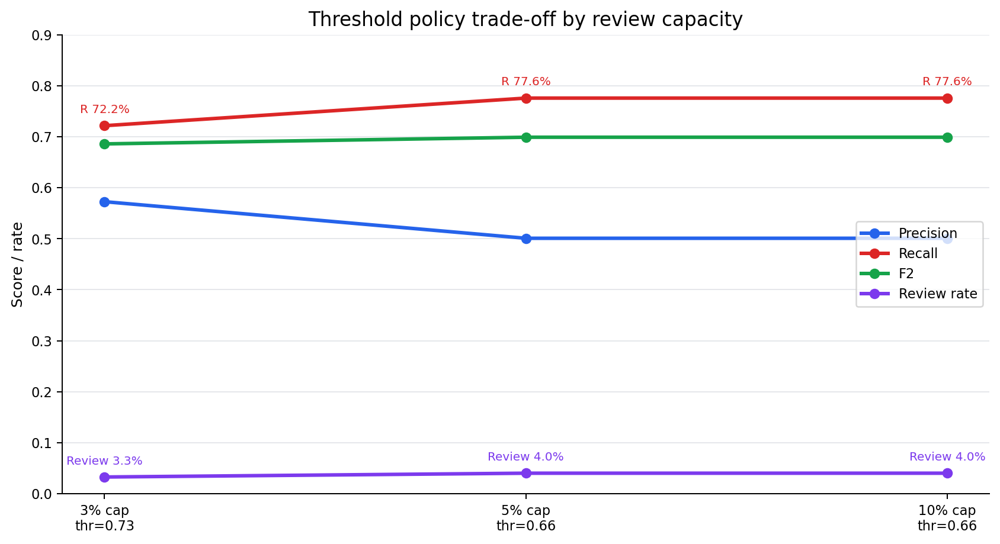
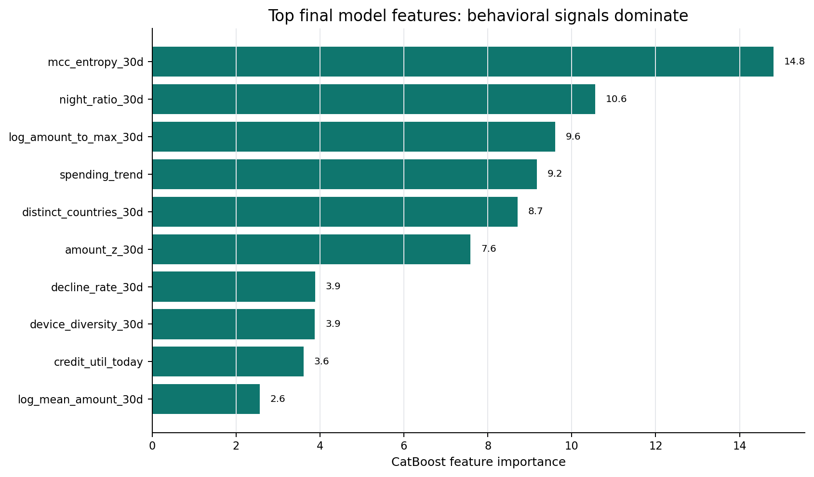
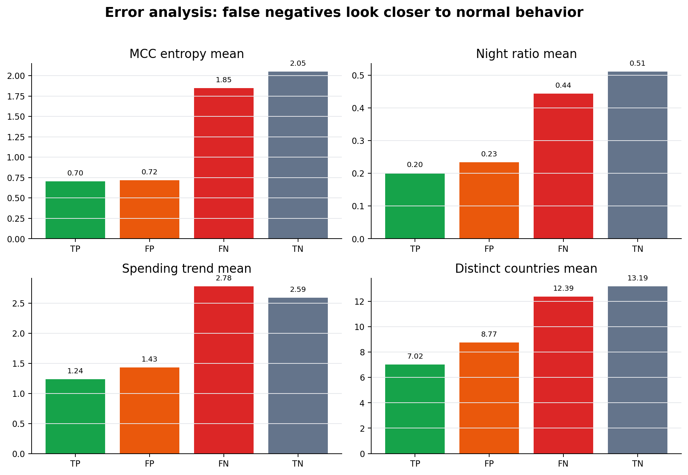

# Tổng hợp output notebook cho báo cáo Fraud Detection

Nguồn tổng hợp: output đã chạy từ `notebooks/01_data_understanding.ipynb` đến `notebooks/09_error_analysis_and_threshold_policy.ipynb`, đặc biệt là các file trong `notebooks/_executed_summary/` và metadata final model trong `models/final_model/`.

## 1. Tóm tắt điều hành

Project xây dựng mô hình phát hiện gian lận giao dịch tài chính trên bộ dữ liệu 100,000 giao dịch. Bài toán có mất cân bằng nhãn rất mạnh: chỉ 2,549 giao dịch fraud, tương ứng 2.55%. Vì vậy, accuracy không phải metric chính. Báo cáo nên tập trung vào PR-AUC, recall, precision, F2, confusion matrix và review rate.

Kết quả cuối cùng chọn CatBoost tuned `cat_tune_depth7_l2_8_lr003_iter700` làm model vận hành. Ở threshold 0.66, model review 4.01% giao dịch test, bắt được 301/388 fraud, đạt recall 77.58%, precision 50.08%, F2 0.699 và PR-AUC 0.703. Đây là điểm vận hành tốt nhất trong threshold policy với giới hạn review 5%.

*Hình 1. Target fraud rất mất cân bằng, vì vậy báo cáo ưu tiên PR-AUC, recall, F2 và review rate thay vì accuracy.*

## 2. Trạng thái chạy notebook

Tất cả 9 notebook đã chạy thành công qua `jupyter nbconvert --execute`.

| Notebook | Nội dung chính | Trạng thái |
| --- | --- | --- |
| 01_data_understanding | Khảo sát dữ liệu, target, missing, duplicate | OK |
| 02_univariate_eda | EDA từng biến, skew, cardinality | OK |
| 03_bivariate_eda_with_target | Fraud rate và lift theo feature/bin | OK |
| 04_hidden_insight_mining | Rule mining và kiểm tra insight ổn định | OK |
| 05_feature_engineering_experiment | Tạo feature model-ready | OK |
| 06_model_baseline_logistic | Logistic Regression baseline | OK |
| 07_advanced_model_comparison | So sánh LightGBM, XGBoost, CatBoost | OK |
| 08_final_model_explainability | Feature importance và insight group | OK |
| 09_error_analysis_and_threshold_policy | Error analysis và policy threshold | OK |

## 3. Data understanding

| Chỉ số | Giá trị |
| --- | ---: |
| Số dòng raw | 100,000 |
| Số cột raw | 36 |
| Missing values | 0 |
| Duplicate rows | 0 |
| Fraud count | 2,549 |
| Non-fraud count | 97,451 |
| Fraud rate | 2.55% |

Diễn giải dùng trong báo cáo:

Dữ liệu sạch ở mức kỹ thuật vì không có missing value và không có dòng trùng lặp. Tuy nhiên, nhãn fraud rất hiếm, chỉ chiếm 2.55%, nên bài toán cần được đánh giá như một bài toán imbalanced classification. Nếu dùng accuracy, mô hình luôn đoán non-fraud vẫn có thể đạt accuracy rất cao nhưng không có giá trị nghiệp vụ.

## 4. Cleaning và feature parsing

| Chỉ số | Giá trị |
| --- | ---: |
| Raw rows | 100,000 |
| Raw columns | 36 |
| Cleaned rows | 100,000 |
| Cleaned columns | 59 |
| New columns added | 23 |
| Invalid amount rows | 0 |
| Cleaned missing values | 0 |

Các cột high-cardinality như `device_id`, `merchant_id`, `ip_risk`, `ip_address`, `local_timestamp` không nên one-hot trực tiếp. Notebook đã xử lý bằng cách parse, drop, grouping hoặc tạo feature hành vi thay vì đưa identifier thô vào model.

## 5. EDA chính

Các biến có phân phối lệch đáng chú ý:

| Feature | Mean | Median | Max | Skewness |
| --- | ---: | ---: | ---: | ---: |
| `std_amount_30d` | 2.449 | 1.830 | 42.970 | 4.532 |
| `mean_amount_30d` | 7.622 | 6.550 | 97.990 | 4.040 |
| `chargebacks_365d` | 0.502 | 0.000 | 10.000 | 3.974 |
| `decline_rate_30d` | 0.166 | 0.154 | 0.666 | 0.787 |

Diễn giải dùng trong báo cáo:

Các biến amount và biến lịch sử chargeback có phân phối lệch phải, phản ánh rằng phần lớn user có hành vi bình thường nhưng tồn tại nhóm nhỏ có giá trị rất lớn hoặc lịch sử rủi ro cao. Đây là lý do cần dùng log transform, binning, anomaly ratio và các mô hình tree-based như CatBoost.

## 6. Insight mining với target

Các pattern rủi ro ổn định nhất tập trung quanh hành vi bất thường của user: MCC entropy thấp, night ratio thấp, max amount cao, spending trend thấp, country diversity thấp và card-not-present.

*Hình 2. Các segment rủi ro có lift ổn định trên cả train và validation, cho thấy insight không chỉ là nhiễu trên một split.*

### Segment ổn định trên train và validation

| Segment | Train lift | Validation lift | Validation fraud rate |
| --- | ---: | ---: | ---: |
| `night_unusual` | 2.796 | 3.280 | 8.27% |
| `very_low_mcc_entropy` | 3.792 | 3.228 | 8.13% |
| `high_max_amount_30d` | 2.462 | 3.069 | 7.73% |
| `low_night_ratio` | 2.850 | 2.910 | 7.33% |
| `low_mcc_entropy` | 3.501 | 2.904 | 7.32% |
| `low_country_diversity` | 2.435 | 2.456 | 6.19% |

### Interaction mạnh

| Rule / feature | Fraud rate | Lift | Ý nghĩa |
| --- | ---: | ---: | --- |
| `low_mcc_entropy AND low_night_ratio AND high_max_amount_30d` | 52.70% | 20.69 | Nhóm rất nhỏ nhưng rủi ro cực cao |
| `low_mcc_entropy AND low_night_ratio AND card_not_present` | 26.72% | 10.49 | Hành vi ngành hàng hẹp, ít giao dịch đêm, không có thẻ vật lý |
| `low_mcc_entropy AND low_night_ratio` | 26.01% | 10.21 | Behavioral anomaly mạnh |
| `low_mcc_entropy AND low_spending_trend` | 23.87% | 9.37 | Hành vi chi tiêu giảm hoặc thấp bất thường |
| `low_mcc_entropy AND high_max_amount_30d` | 22.72% | 8.92 | User có ngành hàng hẹp nhưng lịch sử amount cao |

Diễn giải dùng trong báo cáo:

Fraud không chỉ đến từ một biến đơn lẻ mà đến từ tổ hợp hành vi. Các rule có lift cao cho thấy khi user có lịch sử ngành hàng ít đa dạng, ít giao dịch ban đêm, hoặc có giao dịch card-not-present, rủi ro tăng mạnh. Các insight này được dùng để thiết kế feature và giải thích mô hình.

## 7. Feature engineering

| Split | Rows | Fraud count | Fraud rate | Model features | Numeric | Categorical | Binary | Interaction |
| --- | ---: | ---: | ---: | ---: | ---: | ---: | ---: | ---: |
| Train | 70,000 | 1,783 | 2.55% | 58 | 19 | 21 | 10 | 8 |
| Validation | 15,000 | 378 | 2.52% | 58 | 19 | 21 | 10 | 8 |
| Test | 15,000 | 388 | 2.59% | 58 | 19 | 21 | 10 | 8 |

Các cột bị loại khỏi model: `ip_risk`, `txn_counts`, `ip_address`, `transaction_datetime`.

Diễn giải dùng trong báo cáo:

Train, validation và test giữ fraud rate tương đối ổn định, giúp đánh giá model đáng tin cậy hơn. Feature engineering chuyển dữ liệu từ identifier thô sang các nhóm tín hiệu nghiệp vụ như amount anomaly, MCC behavior, time behavior, velocity, technical risk và country behavior.

## 8. Baseline Logistic Regression

| Metric test | Giá trị |
| --- | ---: |
| Threshold | 0.77 |
| ROC-AUC | 0.895 |
| PR-AUC | 0.533 |
| Precision | 40.45% |
| Recall | 69.85% |
| F2 | 0.610 |
| Review rate | 4.47% |
| TP / FP / FN / TN | 271 / 399 / 117 / 14,213 |

Diễn giải dùng trong báo cáo:

Logistic Regression là baseline dễ giải thích và cho kết quả khá tốt trong bối cảnh fraud rate chỉ 2.55%. Tuy nhiên, baseline tạo nhiều false positive hơn và bỏ sót nhiều fraud hơn so với CatBoost tuned. Vì vậy baseline nên dùng làm mốc so sánh, không phải model vận hành cuối cùng.

## 9. So sánh model advanced

*Hình 3. Final CatBoost tuned cải thiện rõ PR-AUC, recall và F2 so với Logistic Regression baseline, trong khi precision vẫn ở mức vận hành được.*

### Nhóm GPU boosting

| Experiment | Model | Test PR-AUC | Precision | Recall | F2 | Review rate |
| --- | --- | ---: | ---: | ---: | ---: | ---: |
| `cat_gpu_mcc_minfreq_100_no_interactions` | CatBoost | 0.697 | 52.64% | 74.48% | 0.688 | 3.66% |
| `cat_gpu_mcc_minfreq_100` | CatBoost | 0.694 | 51.32% | 75.00% | 0.687 | 3.78% |
| `lgbm_gpu_no_mcc` | LightGBM | 0.679 | 50.17% | 74.23% | 0.677 | 3.83% |
| `xgb_gpu_mcc_minfreq_100` | XGBoost | 0.685 | 49.23% | 73.97% | 0.672 | 3.89% |

### CatBoost tuning

*Hình 4. Trong các cấu hình CatBoost tuning, bản depth=7, l2=8, learning_rate=0.03 đạt F2 tốt nhất và recall cao nhất.*

| Experiment | Threshold | Test PR-AUC | Precision | Recall | F2 | Review rate |
| --- | ---: | ---: | ---: | ---: | ---: | ---: |
| `cat_tune_depth7_l2_8_lr003_iter700` | 0.66 | 0.703 | 50.08% | 77.58% | 0.699 | 4.01% |
| `cat_tune_depth6_l2_10_lr003_iter700` | 0.74 | 0.696 | 52.44% | 74.74% | 0.689 | 3.69% |
| `cat_tune_base_depth6_l2_5_lr003_iter700` | 0.74 | 0.697 | 52.64% | 74.48% | 0.688 | 3.66% |
| `cat_tune_depth5_l2_8_lr003_iter700` | 0.74 | 0.682 | 47.60% | 76.55% | 0.682 | 4.16% |
| `cat_tune_depth6_l2_5_lr002_iter1000` | 0.71 | 0.693 | 47.67% | 76.29% | 0.681 | 4.14% |

Diễn giải dùng trong báo cáo:

CatBoost là nhóm model phù hợp nhất vì xử lý tốt categorical features, quan hệ phi tuyến và tương tác giữa feature. Sau tuning, bản depth=7, l2=8, learning_rate=0.03, iterations=700 đạt F2 cao nhất và recall cao nhất trong khi review rate vẫn dưới 5%.

## 10. Final model và threshold policy

Final model đã được promote trong `models/final_model/final_model_metadata.json`:

- Experiment: `cat_tune_depth7_l2_8_lr003_iter700`
- Model: CatBoost
- Dùng MCC với rare category grouping `min_frequency=100`
- Bỏ manual interaction features
- Threshold vận hành: 0.66
- Threshold được chọn trên validation, sau đó áp dụng trên test

Kết quả test ở threshold 0.66:

*Hình 5. Confusion matrix của final model ở threshold 0.66 trên tập test.*

| Metric | Giá trị |
| --- | ---: |
| Rows test | 15,000 |
| Fraud thật | 388 |
| Predicted positive / review | 601 |
| Review rate | 4.01% |
| Precision | 50.08% |
| Recall | 77.58% |
| F1 | 0.609 |
| F2 | 0.699 |
| ROC-AUC | 0.901 |
| PR-AUC | 0.703 |
| TP / FP / FN / TN | 301 / 300 / 87 / 14,312 |

Diễn giải nghiệp vụ:

Nếu áp dụng trên 15,000 giao dịch test, model sẽ đưa 601 giao dịch vào luồng review hoặc cảnh báo fraud. Trong đó có 301 giao dịch thật sự fraud và 300 giao dịch không fraud bị cảnh báo nhầm. Model bỏ sót 87 fraud. Với fraud rate gốc chỉ 2.59% trên test, precision 50.08% nghĩa là nhóm bị cảnh báo có mật độ fraud cao hơn rất nhiều so với nền dữ liệu.

## 11. Review capacity scenarios

*Hình 6. Threshold policy thể hiện trade-off giữa precision, recall, F2 và review rate theo năng lực review.*

| Review cap | Threshold | Test precision | Test recall | Test F2 | Test review rate | TP | FP | FN |
| ---: | ---: | ---: | ---: | ---: | ---: | ---: | ---: | ---: |
| 3% | 0.73 | 57.26% | 72.16% | 0.686 | 3.26% | 280 | 209 | 108 |
| 5% | 0.66 | 50.08% | 77.58% | 0.699 | 4.01% | 301 | 300 | 87 |
| 10% | 0.66 | 50.08% | 77.58% | 0.699 | 4.01% | 301 | 300 | 87 |

Diễn giải dùng trong báo cáo:

Nếu đội vận hành chỉ review khoảng 3% giao dịch, threshold 0.73 phù hợp hơn vì precision cao hơn 57.26% và số false positive thấp hơn. Nếu mục tiêu chính là bắt được nhiều fraud hơn trong giới hạn review 5%, threshold 0.66 tốt hơn vì recall tăng lên 77.58% và F2 cao nhất. Việc chọn threshold là quyết định nghiệp vụ giữa chi phí bỏ sót fraud và chi phí review nhầm.

## 12. Explainability

Top feature importance của final CatBoost:

*Hình 7. Top feature của final model chủ yếu là tín hiệu hành vi, không phải ID thô.*

| Feature | Importance |
| --- | ---: |
| `numeric__mcc_entropy_30d` | 14.812 |
| `numeric__night_ratio_30d` | 10.559 |
| `numeric__log_amount_to_max_30d` | 9.602 |
| `numeric__spending_trend` | 9.172 |
| `numeric__distinct_countries_30d` | 8.710 |
| `numeric__amount_z_30d` | 7.588 |
| `numeric__decline_rate_30d` | 3.885 |
| `numeric__device_diversity_30d` | 3.881 |
| `numeric__credit_util_today` | 3.609 |
| `numeric__log_mean_amount_30d` | 2.567 |

Nhóm insight quan trọng:

| Insight group | Feature count | Tổng độ quan trọng tuyệt đối |
| --- | ---: | ---: |
| Time behavior anomaly | 21 | 8.110 |
| Payment / authentication context | 68 | 6.936 |
| Amount anomaly | 9 | 4.345 |
| MCC behavior anomaly | 8 | 3.612 |
| Country / cross-border behavior | 24 | 2.963 |
| Risk history / technical risk | 17 | 2.493 |

Diễn giải dùng trong báo cáo:

Model không phụ thuộc vào ID thô mà học chủ yếu từ hành vi: độ đa dạng MCC, thói quen giao dịch ban đêm, mức lệch amount so với lịch sử, xu hướng chi tiêu, đa dạng quốc gia, decline rate, device diversity và credit utilization. Điều này làm model dễ giải thích hơn về mặt nghiệp vụ.

## 13. Error analysis

Ở threshold 0.66:

*Hình 8. False negative có profile gần nhóm normal hơn TP/FP, giải thích vì sao model khó bắt các fraud này.*

| Error type | Count | Ratio |
| --- | ---: | ---: |
| TN | 14,312 | 95.41% |
| TP | 301 | 2.01% |
| FP | 300 | 2.00% |
| FN | 87 | 0.58% |

Một số khác biệt đáng chú ý:

| Nhóm | MCC entropy mean | Night ratio mean | Spending trend mean | Distinct countries mean |
| --- | ---: | ---: | ---: | ---: |
| TP | 0.704 | 0.202 | 1.237 | 7.02 |
| FP | 0.719 | 0.234 | 1.432 | 8.77 |
| FN | 1.846 | 0.444 | 2.782 | 12.39 |
| TN | 2.048 | 0.511 | 2.594 | 13.19 |

Diễn giải dùng trong báo cáo:

TP và FP đều có dấu hiệu rủi ro rõ hơn bình thường: MCC entropy thấp, night ratio thấp và country diversity thấp. Điều này giải thích vì sao model cảnh báo các giao dịch này. Ngược lại, FN có đặc điểm gần với nhóm bình thường hơn, ví dụ MCC entropy và night ratio cao hơn TP/FP, nên model khó nhận diện. Đây là hướng cải thiện tiếp theo: tìm thêm feature giúp phân biệt fraud tinh vi có hành vi gần giống normal.

## 14. Kết luận đề xuất cho báo cáo

Project đã xây dựng được pipeline fraud detection hoàn chỉnh từ data understanding, EDA, insight mining, feature engineering, baseline model, advanced model comparison, model tuning, explainability, error analysis đến threshold policy. Kết quả cho thấy CatBoost tuned là lựa chọn tốt nhất cho vận hành vì cân bằng tốt giữa recall và review rate.

Với threshold 0.66, model bắt được 77.58% fraud trên test trong khi chỉ cần review 4.01% giao dịch. So với Logistic Regression baseline, final CatBoost tăng recall từ 69.85% lên 77.58%, tăng F2 từ 0.610 lên 0.699 và tăng PR-AUC từ 0.533 lên 0.703. Các feature quan trọng cũng khớp với insight nghiệp vụ, chủ yếu xoay quanh MCC behavior, night behavior, amount anomaly, spending trend và country diversity.

## 15. Câu chữ ngắn có thể dùng trong phần final conclusion

Trong bài toán fraud detection có nhãn mất cân bằng mạnh, mô hình cuối cùng không được chọn theo accuracy mà theo khả năng bắt fraud trong giới hạn review. CatBoost tuned `cat_tune_depth7_l2_8_lr003_iter700` đạt kết quả tốt nhất với PR-AUC 0.703, recall 77.58%, precision 50.08%, F2 0.699 và review rate 4.01% trên tập test. Model học được các tín hiệu nghiệp vụ hợp lý như MCC entropy thấp, night behavior bất thường, amount anomaly, spending trend và country diversity, do đó vừa có hiệu năng tốt vừa có khả năng giải thích cho báo cáo.
