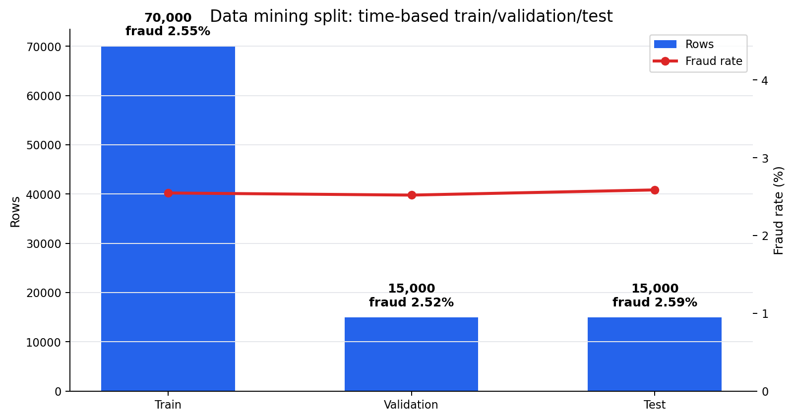
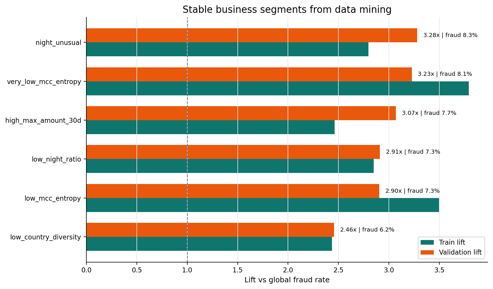
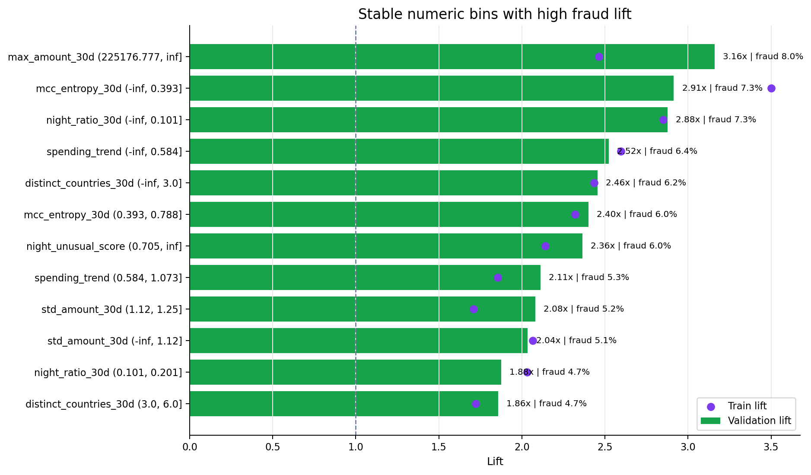
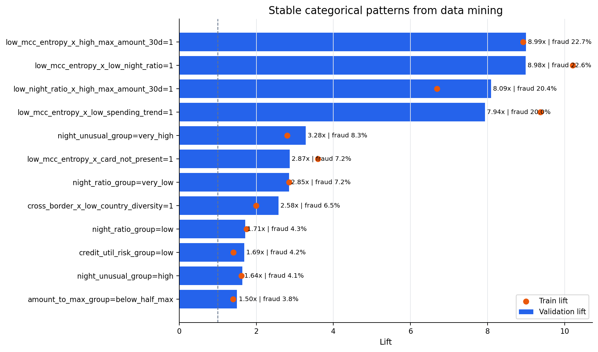
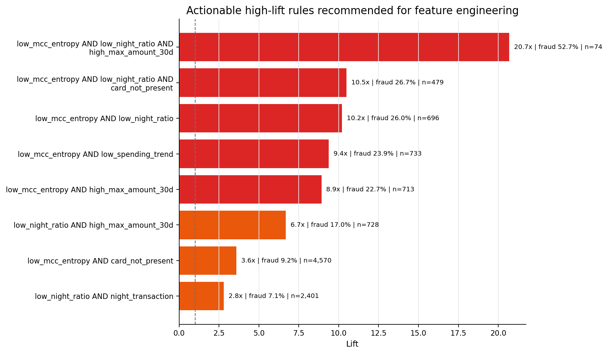
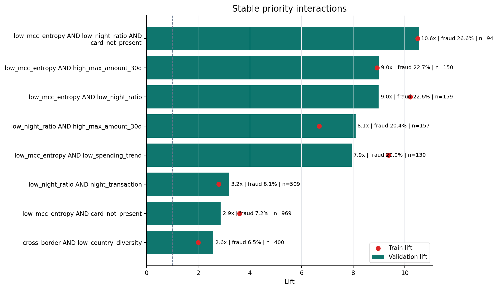
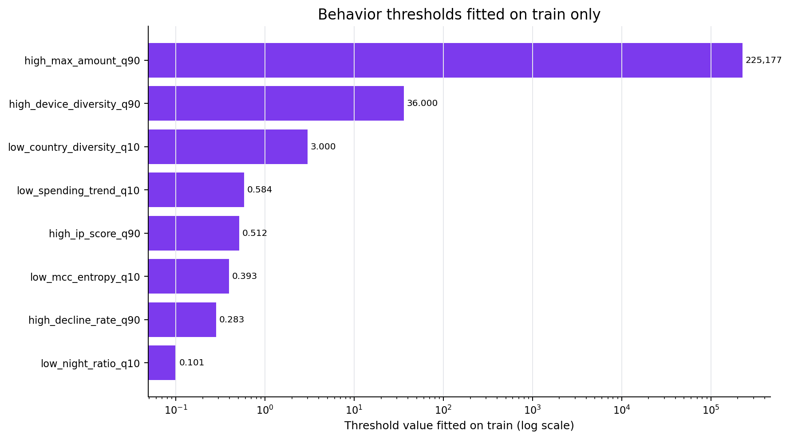

# Data Mining Visualization Gallery

Các hình này được sinh từ output CSV của `scripts/03_run_insight_mining.py`.

## Split theo thời gian và fraud rate từng tập.

## Các business segment có lift ổn định trên train/validation.

## Các numeric bin có fraud lift cao và ổn định.

## Các categorical value có fraud lift cao và ổn định.

## Rule lift cao được khuyến nghị chuyển thành feature.

## Interaction ưu tiên ổn định giữa train và validation.

## Các behavior thresholds được fit từ train.

